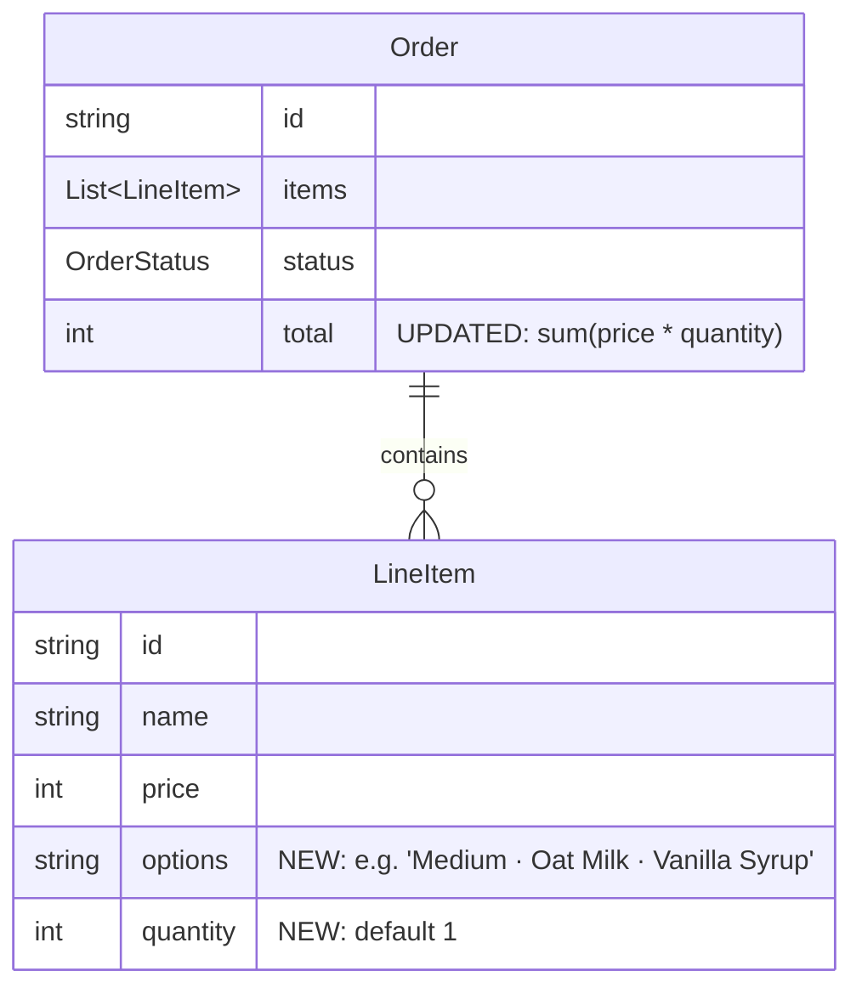

# ✨ feat: implement cart page with LineItem model extension

## Overview

Add a `/cart` screen where users review their in-progress order, adjust item quantities, and remove items. This requires extending the `LineItem` model with `options` and `quantity` fields, adding a new `updateItemQuantity` WS action on the backend, updating `ItemDetailBloc` to pass options and call `addItemToCurrentOrder` once (removing the loop), and implementing a `CartBloc` + `CartPage` + `CartView` following the established feature folder pattern.

The checkout button is **out of scope**. The cart is complete when items can be viewed, quantities adjusted, and items removed.

## Problem Statement

The current `LineItem` model (`shared/order_repository/lib/src/models/line_item.dart`) stores only `id`, `name`, and `price`. It has no `quantity` field (multiple units of the same item are stored as separate line items) and no `options` field (customizations like size and milk are lost after the item is added). The cart screen design requires both. Additionally, there is no `updateItemQuantity` WS action — only `addItemToOrder` and `removeItemFromOrder` — so quantity changes from the cart cannot be expressed without a new backend action.

## Proposed Solution

1. Extend `LineItem` with `options: String` and `quantity: int`
2. Update `Order.total` to multiply price by quantity
3. Add `updateItemQuantity` WS action (server + repository)
4. Simplify `ItemDetailBloc._onAddToCartRequested` to call `addItemToCurrentOrder` once with the quantity and options string
5. Update `ItemDetailView` to navigate to `/cart` (instead of `context.pop()`) on `added` status
6. Implement the `cart` feature following the existing page/view/bloc pattern

## Technical Approach

### Model ERD



### Feature Folder Structure

```
applications/mobile_app/lib/cart/
  cart.dart                      # barrel: exports bloc and view/view.dart
  bloc/
    cart_bloc.dart               # Bloc class, part directives
    cart_event.dart              # part of cart_bloc.dart
    cart_state.dart              # part of cart_bloc.dart
    cart_bloc.mapper.dart        # generated by dart_mappable
  view/
    view.dart                    # exports CartPage and CartView
    cart_page.dart               # BlocProvider + CartSubscriptionRequested dispatch
    cart_view.dart               # BlocBuilder + Scaffold + private widgets
```

### CartBloc Design

```dart
// cart_event.dart
@MappableClass()
sealed class CartEvent { const CartEvent(); }

@MappableClass()
class CartSubscriptionRequested extends CartEvent
    with CartSubscriptionRequestedMappable {
  const CartSubscriptionRequested();
}

@MappableClass()
class CartItemQuantityUpdated extends CartEvent
    with CartItemQuantityUpdatedMappable {
  const CartItemQuantityUpdated({required this.lineItemId, required this.quantity});
  final String lineItemId;
  final int quantity; // 0 = remove
}

// cart_state.dart
@MappableEnum()
enum CartStatus { initial, loading, success, failure }

@MappableClass()
class CartState with CartStateMappable {
  const CartState({
    this.order,
    this.status = CartStatus.initial,
  });
  final Order? order;
  final CartStatus status;
}
```

Tax is computed in the view as `(order.total * 8 + 50) ~/ 100` (integer arithmetic, round-half-up cents), not stored in state.

The `initial` status handles the seeded-null-emission race: `OrderRepository._ordersSubject` is seeded with `Orders(orders: [])`, which causes `currentOrderStream` to emit `null` immediately before the server snapshot arrives. CartView shows a loading indicator for `CartStatus.initial` and `CartStatus.loading`, so the user never sees a flash of empty-state before the real data arrives.

### Options String Format

The options string is built in `ItemDetailBloc._onAddToCartRequested` from the bloc's state:

```
"${state.selectedSize.label} · ${state.selectedMilk.label}"
// if extras present: "Medium · Oat Milk · Extra Shot · Vanilla Syrup"
```

To do this, `label` getters must be accessible from the bloc. `DrinkSize`, `MilkOption`, and `DrinkExtra` are defined in `item_detail_state.dart` (not in `menu_repository`). **Promote the private label extensions** from `item_detail_view.dart` to public getters directly on the enum definitions in `item_detail_state.dart`. Update `item_detail_view.dart` to use the public getters instead of its private extensions. No cross-package move is needed.

---

## Implementation Phases

### Phase 1: LineItem model extension

**Files to change:**
- `shared/order_repository/lib/src/models/line_item.dart` — add `options: String` (default `''`) and `quantity: int` (default `1`)
- `shared/order_repository/lib/src/models/order.dart` — update `total` getter: `items.fold(0, (sum, i) => sum + i.price * i.quantity)`
- `shared/order_repository/lib/src/order_repository.dart`:
  - Update `addItemToCurrentOrder` signature: add `required String options` and `required int quantity` params; update WS payload to include `options` and `quantity`
  - Add new method `updateItemQuantity(String lineItemId, int quantity)` that sends `updateItemQuantity` WS action with `{orderId, lineItemId, quantity}`. Must guard with `if (currentOrderId == null) return;` (same as `removeItemFromCurrentOrder`).
- Run `dart run build_runner build` to regenerate `line_item.mapper.dart` and `order.mapper.dart`

**Acceptance:** `LineItem` has `options` and `quantity`. `Order.total` returns `sum(price * quantity)`. `addItemToCurrentOrder` accepts and sends options + quantity. `updateItemQuantity` method exists.

---

### Phase 2: Backend — updateItemQuantity handler

**File to change:**
- `api/lib/src/server_state.dart` — add `updateItemQuantity` case to `handleAction`:

```dart
case 'updateItemQuantity':
  final orderId = payload['orderId'] as String;
  final lineItemId = payload['lineItemId'] as String;
  final quantity = payload['quantity'] as int;
  final order = _orders[orderId];
  if (order != null) {
    final items = List<Map<String, dynamic>>.from(
      order['items'] as List<dynamic>,
    );
    if (quantity == 0) {
      items.removeWhere((item) => item['id'] == lineItemId);
    } else {
      final idx = items.indexWhere((item) => item['id'] == lineItemId);
      if (idx != -1) items[idx] = {...items[idx], 'quantity': quantity};
    }
    _orders[orderId] = <String, dynamic>{...order, 'items': items};
    broadcast('orders', snapshotForTopic('orders'));
    broadcast('order:$orderId', _orders[orderId]!);
  }
```

Also update the `addItemToOrder` case to include `options` and `quantity` when building the stored item map:

```dart
..add({
  'id': payload['lineItemId'] as String,
  'name': payload['itemName'] as String,
  'price': payload['itemPrice'] as int,
  'options': payload['options'] as String? ?? '',  // NEW
  'quantity': payload['quantity'] as int? ?? 1,    // NEW
});
```

**Acceptance:** Server accepts `updateItemQuantity` and broadcasts updated order. `addItemToOrder` stores `options` and `quantity`.

---

### Phase 3: Enum labels + ItemDetailBloc update

**Files to change:**
- `applications/mobile_app/lib/item_detail/bloc/item_detail_state.dart` — promote the private `label` extensions from `item_detail_view.dart` to public getters on `DrinkSize`, `MilkOption`, and `DrinkExtra` (these enums are defined here, not in `menu_repository`).
- `applications/mobile_app/lib/item_detail/view/item_detail_view.dart` — remove the now-duplicate private `extension on DrinkSize`, `extension on MilkOption`, `extension on DrinkExtra`; use the public getters directly.
- `applications/mobile_app/lib/item_detail/bloc/item_detail_bloc.dart` — update `_onAddToCartRequested`:
  - Build options string: `[selectedSize.label, selectedMilk.label, ...selectedExtras.map((e) => e.label)].join(' · ')`
  - Remove the `for` loop; call `addItemToCurrentOrder` **once** with `quantity: state.quantity, options: optionsString`
- `applications/mobile_app/lib/item_detail/view/item_detail_view.dart` — change `BlocConsumer` listener: replace `context.pop()` with `context.go(CartPage.routePath)` when status is `ItemDetailStatus.added`. The `_HeroSection` back button (`context.pop()` at `item_detail_view.dart:103`) is **intentionally unchanged** — it pops correctly from item-detail back to menu-items and is unreachable once the `added` listener fires `context.go('/cart')`.
- Update `item_detail_bloc_test.dart`:
  - Update mock for `addItemToCurrentOrder` to include `options` and `quantity` params
  - The "calls addItemToCurrentOrder once per quantity" test becomes "calls addItemToCurrentOrder once with quantity: N"
- Update `item_detail_view_test.dart`:
  - Change the "calls pop when status becomes added" test to verify `goRouter.go(CartPage.routePath)` instead of `goRouter.pop()`

**Acceptance:** Bloc builds options string from state. Single `addItemToCurrentOrder` call per add-to-cart action. "Added" state navigates to `/cart`. `_HeroSection` back button unchanged.

---

### Phase 4: Cart feature

**Files to create:**

**`cart_event.dart`**
```dart
part of 'cart_bloc.dart';

@MappableClass()
sealed class CartEvent { const CartEvent(); }

@MappableClass()
class CartSubscriptionRequested extends CartEvent
    with CartSubscriptionRequestedMappable {
  const CartSubscriptionRequested();
}

@MappableClass()
class CartItemQuantityUpdated extends CartEvent
    with CartItemQuantityUpdatedMappable {
  const CartItemQuantityUpdated({
    required this.lineItemId,
    required this.quantity,
  });
  final String lineItemId;
  final int quantity; // 0 = remove
}
```

**`cart_state.dart`**
```dart
part of 'cart_bloc.dart';

@MappableEnum()
enum CartStatus { initial, loading, success, failure }

@MappableClass()
class CartState with CartStateMappable {
  const CartState({
    this.order,
    this.status = CartStatus.initial,
  });
  final Order? order;
  final CartStatus status;
}
```

**`cart_bloc.dart`**
```dart
class CartBloc extends Bloc<CartEvent, CartState> {
  CartBloc({required OrderRepository orderRepository})
      : _orderRepository = orderRepository,
        super(const CartState()) {
    on<CartSubscriptionRequested>(_onSubscriptionRequested);
    on<CartItemQuantityUpdated>(_onItemQuantityUpdated);
  }

  final OrderRepository _orderRepository;

  Future<void> _onSubscriptionRequested(
    CartSubscriptionRequested event,
    Emitter<CartState> emit,
  ) async {
    emit(state.copyWith(status: CartStatus.loading));
    await emit.forEach(
      _orderRepository.currentOrderStream,
      onData: (order) => state.copyWith(order: order, status: CartStatus.success),
      onError: (_, _) => state.copyWith(status: CartStatus.failure),
    );
  }

  void _onItemQuantityUpdated(
    CartItemQuantityUpdated event,
    Emitter<CartState> emit,
  ) {
    _orderRepository.updateItemQuantity(event.lineItemId, event.quantity);
  }
}
```

**`cart_page.dart`**
```dart
class CartPage extends StatelessWidget {
  const CartPage({super.key});

  static const routeName = 'cart';   // named-route identifier (no leading slash)
  static const routePath = '/cart';  // URL path (used with context.go)

  factory CartPage.pageBuilder(BuildContext _, GoRouterState state) =>
      const CartPage(key: Key('cart_page'));

  @override
  Widget build(BuildContext context) {
    return BlocProvider(
      create: (_) => CartBloc(
        orderRepository: context.read<OrderRepository>(),
      )..add(const CartSubscriptionRequested()),
      child: const CartView(),
    );
  }
}
```

**`cart_view.dart`** — `BlocBuilder<CartBloc, CartState>` containing:
- `_CartHeader` — back button (`context.go(MenuGroupsPage.routeName)`), "My Cart" title, item count subtitle; primary background color. **Do not use `context.pop()`** — `/cart` is reached via `context.go()` which clears the back stack; `pop()` would crash or no-op.
- `_CartItemList` — `ListView` of `_CartItemCard` widgets
- `_CartItemCard` — icon, name, options text, price, trash button, quantity controls (+/-); sending `CartItemQuantityUpdated`
  - Trash: `CartItemQuantityUpdated(lineItemId: id, quantity: 0)`
  - `-` button: `CartItemQuantityUpdated(lineItemId: id, quantity: item.quantity - 1)` (0 if at 1 → removes item)
  - `+` button: `CartItemQuantityUpdated(lineItemId: id, quantity: item.quantity + 1)`
- `_OrderSummaryCard` — subtotal, tax (8%), total rows
- `_EmptyCartView` — shown when `order == null || order.items.isEmpty`; message + browse menu button (`context.go(MenuGroupsPage.routeName)`)
- Loading indicator for `CartStatus.initial` and `CartStatus.loading`
- `CartStatus.failure`: show a generic error message (e.g. "Something went wrong") — no retry mechanism required

**Price formatting:** `'\$${(price / 100).toStringAsFixed(2)}'` (matching existing pattern)

**`cart.dart`** barrel file, **`view/view.dart`** barrel file.

Run `dart run build_runner build` to regenerate `cart_bloc.mapper.dart`.

**Acceptance:** Cart screen renders. Items display name, options, price. Quantity +/- sends WS action. Trash removes item. Empty state shows when order is empty.

---

### Phase 5: Router + navigation

**File to change:**
- `applications/mobile_app/lib/app/app_router/app_router.dart` — add `/cart` as a top-level `GoRoute` alongside `/menu`:

```dart
GoRoute(
  name: CartPage.routeName,    // 'cart'
  path: CartPage.routePath,    // '/cart'
  pageBuilder: (context, state) => MaterialPage(
    name: CartPage.routeName,
    child: CartPage.pageBuilder(context, state),
  ),
),
```

Navigate to cart with `context.go(CartPage.routePath)` — a single source of truth over a bare `'/cart'` string.

**Acceptance:** `context.go(CartPage.routePath)` from ItemDetail renders CartPage. Back button from CartPage navigates to `MenuGroupsPage.routeName`.

---

### Phase 6: Tests

**Files to create:**

**`test/cart/bloc/cart_bloc_test.dart`**
- Group `CartSubscriptionRequested`:
  - emits `[loading]` then `[success with order]` on stream data (verify the explicit loading emission before `emit.forEach`)
  - emits `[loading, failure]` on stream error
- Group `CartItemQuantityUpdated`: verifies `orderRepository.updateItemQuantity` called with correct args; verifies quantity=0 when decrementing at 1

**`test/cart/view/cart_view_test.dart`** (using `pumpApp` helper)
- Use `when(() => bloc.state).thenReturn(state)` **and** `whenListen(bloc, Stream.value(state))` for each state under test — `BlocBuilder` requires both to rebuild (following the pattern in `item_detail_view_test.dart`)
- `CartStatus.initial` / `CartStatus.loading` shows `CircularProgressIndicator`
- `CartStatus.success` with order shows item cards, subtotal, tax, total
- `CartStatus.success` with null/empty order shows empty cart message
- `CartStatus.failure` shows error message
- Tapping `+` dispatches `CartItemQuantityUpdated` with incremented quantity
- Tapping trash dispatches `CartItemQuantityUpdated` with quantity 0
- Tapping `-` at quantity 1 dispatches `CartItemQuantityUpdated` with quantity 0

**`test/item_detail/bloc/item_detail_bloc_test.dart`** — update existing tests:
- `ItemDetailAddToCartRequested` group: update `verify` calls to match new `addItemToCurrentOrder` signature (add `options` and `quantity` params)
- Replace "calls addItemToCurrentOrder once per quantity" test with "calls addItemToCurrentOrder once with quantity: N"

**`test/item_detail/view/item_detail_view_test.dart`** — update existing test:
- Change "calls pop when status becomes added" to verify `goRouter.go(CartPage.routePath)` instead of `goRouter.pop()`

---

## Alternative Approaches Considered

**Client-side grouping + name-encoded options:** No model changes; group flat line items by name for quantity display; pack options into the item name string. Rejected: options can't be recovered from a packed name without fragile string parsing.

**Structured options sub-object:** Model options as separate `size`, `milk`, `extras` fields on `LineItem`. Rejected: a formatted string is sufficient for display; structured fields add model complexity with no current benefit.

---

## Acceptance Criteria

### Functional Requirements

- [ ] Navigating to `/cart` from item detail (on `added` status) renders the cart screen
- [ ] Cart header shows "My Cart" and the total number of items
- [ ] Each cart item shows: name, options string, formatted price, quantity, trash button
- [ ] Tapping `+` increments quantity and sends WS action; order total updates
- [ ] Tapping `-` at quantity > 1 decrements; at quantity 1, removes item
- [ ] Tapping trash removes the item
- [ ] Order summary shows: subtotal (sum of line totals), tax (8%), total
- [ ] Empty state shown when no active order or all items removed
- [ ] Empty state has a "Browse menu" navigation action
- [ ] All existing `item_detail_bloc_test.dart` tests pass (updated for new signature)

### Quality Gates

- [ ] `dart analyze` passes with no issues
- [ ] All new bloc tests use `blocTest` from `bloc_test`
- [ ] All new widget tests use `pumpApp` helper
- [ ] Mock objects use `mocktail`
- [ ] Code generation artifacts regenerated (`build_runner build`)

---

## Dependencies & Prerequisites

| Dependency | Notes |
|---|---|
| `order_repository` model extension | Phase 1 must complete before Phase 4 (CartBloc) |
| Backend `updateItemQuantity` handler | Phase 2 needed before end-to-end manual testing |
| Enum label getters in `item_detail_state.dart` | Phase 3 prerequisite; promote private view extensions to public enum getters |
| `CartPage.routeName` | Phase 5 references it; define in cart_page.dart first |

---

## Risk Analysis

| Risk | Impact | Mitigation |
|---|---|---|
| `build_runner` conflicts | Low | Run `build_runner build --delete-conflicting-outputs` |
| `addItemToCurrentOrder` signature change breaks callers | Medium | Only one caller (`ItemDetailBloc`); update it in Phase 3 |
| Tax rounding (float precision) | Low | Use integer cents throughout; round only for display |
| `Order.total` breaking change | Low | Only one consumer (`ItemDetailState.totalPrice`); update it |

---

## References

### Internal References

- Brainstorm: `wingspan/brainstorms/2026-02-23-cart-page-brainstorm-doc.md`
- LineItem model: `shared/order_repository/lib/src/models/line_item.dart`
- Order model: `shared/order_repository/lib/src/models/order.dart`
- OrderRepository: `shared/order_repository/lib/src/order_repository.dart`
- Backend actions: `api/lib/src/server_state.dart`
- ItemDetailBloc (add-to-cart reference): `applications/mobile_app/lib/item_detail/bloc/item_detail_bloc.dart:87`
- ItemDetailView (navigation reference): `applications/mobile_app/lib/item_detail/view/item_detail_view.dart:16`
- AppRouter (route registration): `applications/mobile_app/lib/app/app_router/app_router.dart`
- pumpApp test helper: `applications/mobile_app/test/helpers/pump_app.dart`
- Price formatting pattern: `applications/mobile_app/lib/item_detail/view/item_detail_view.dart:146`
- Design source: `design.pen` → "Cart" frame (node `ZQl3x`)
