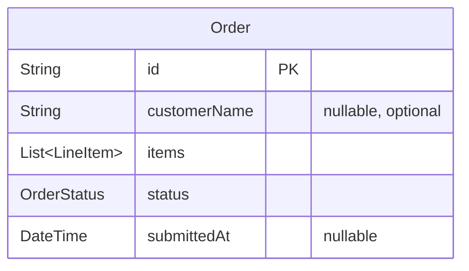

## feat: add customer name to orders - Extensive

## Overview

Add an optional `customerName` to orders so baristas can call out names when drinks are ready. The feature spans the full stack: shared Order model, server state, WS action, repository, and UI across four apps (mobile, kiosk, POS, KDS). A single `updateNameOnOrder` WS action is the only path to set the name across all apps.

## Problem Statement

Currently orders are identified only by a 4-character hex order number (e.g., `#A7F2`). In a busy coffee shop, calling out cryptic order numbers is error-prone and impersonal. Adding a customer name makes the handoff smoother and more friendly.

## Proposed Solution

- Add `String? customerName` to the `Order` model
- Add `updateNameOnOrder` WS action on the server (the **only** mutation path for names)
- Add `updateNameOnCurrentOrder(String customerName)` to `OrderRepository` (auto-creates order if needed)
- Each app collects/displays the name per its context:
  - **Mobile**: name field on checkout screen (same pattern as kiosk)
  - **Kiosk**: name field on checkout screen
  - **POS**: always-editable field on order ticket, debounced 500ms
  - **KDS**: display name on order cards

## Technical Approach

### Architecture



### Key Design Decisions

| Decision | Choice | Rationale |
|----------|--------|-----------|
| Model type | `String?` (null = not set) | Matches `submittedAt` pattern on same model |
| Mutation path | `updateNameOnOrder` only | Name never known at `createOrder` time across all apps |
| Server status guard | `pending` only | After submission, name is immutable |
| Max length | 30 characters | Prevents KDS/POS layout overflow |
| Trim whitespace | Client-side before send | Prevents blank-looking names like `"  "` |
| Empty = clear | Yes, empty string clears the name | POS barista can un-name an order |

### WS Protocol Additions

**Client -> Server:**
```json
{"type": "action", "action": "updateNameOnOrder", "payload": {"orderId": "<uuid>", "customerName": "Marcus"}}
```

**Server behavior:**
- Only applies to orders with `status == 'pending'`
- Stores `customerName` on the order map
- Broadcasts to `orders` and `order:<id>` topics
- Empty/null `customerName` clears the field

### Implementation Phases

---

#### Phase 0: Shared Layer (Model + Server + Repository)

Foundation that all apps depend on. Must be complete before any app work.

**Tasks:**

- [ ] Add `String? customerName` field to `Order` model
  - File: `shared/order_repository/lib/src/models/order.dart`
  - Run `dart run build_runner build` in `shared/order_repository` to regenerate mapper
- [ ] Add `updateNameOnOrder` case to `ServerState.handleAction`
  - File: `api/lib/src/server_state.dart`
  - Guard: only when `order['status'] == 'pending'`
  - Store `customerName` on the order map
  - Broadcast to `orders` and `order:<id>` topics
  - Include `customerName` in `createOrder` initial map (as `null`)
- [ ] Add `updateNameOnCurrentOrder(String customerName)` to `OrderRepository`
  - File: `shared/order_repository/lib/src/order_repository.dart`
  - Auto-create order if `currentOrderId == null` (same pattern as `addItemToCurrentOrder`)
  - Trim the name; if empty after trim, send `null` in payload
  - Send `updateNameOnOrder` WS action with `currentOrderId`
- [ ] Update CLAUDE.md WebSocket protocol documentation with new action
- [ ] Unit tests for `ServerState.handleAction('updateNameOnOrder', ...)`
  - Test: sets name on pending order
  - Test: rejects name update on submitted/completed/cancelled order
  - Test: empty name clears `customerName`
  - Test: broadcasts to subscribers
- [ ] Unit tests for `OrderRepository.updateNameOnCurrentOrder`
  - Test: auto-creates order then sets name
  - Test: sets name on existing current order
  - Test: trims whitespace

**Success criteria:** `Order` model includes `customerName`, server handles the action, repository exposes the method, all tests pass.

---

#### Phase 1: KDS App (Display Only)

Simplest consumer — read-only display. Good first integration test of the model change.

**Tasks:**

- [ ] Update `KdsOrderCard` to display `customerName` below the order number
  - File: `applications/kds_app/lib/kds/view/widgets/kds_order_card.dart`
  - Show `order.customerName` in `context.typography.body` with `fontWeight: FontWeight.w600` below the existing order number `Text`
  - If `customerName` is null or empty, show nothing (existing layout preserved)
- [ ] Add l10n key if needed (likely not — just displaying the raw name)
- [ ] Widget test: `KdsOrderCard` renders customer name when present
  - File: `applications/kds_app/test/kds/view/widgets/kds_order_card_test.dart`
- [ ] Widget test: `KdsOrderCard` omits name row when `customerName` is null

**Success criteria:** KDS cards show customer name prominently; no name = no change to existing layout.

---

#### Phase 2: POS App (Name Input + Display)

Most complex app — debounced text field, flush-on-submit, clear-on-reset, plus display in order history.

**Tasks:**

##### 2a: OrderTicketBloc changes

- [ ] Add `OrderTicketCustomerNameChanged(String name)` event
  - File: `applications/pos_app/lib/order_ticket/bloc/order_ticket_event.dart`
  - Follow existing pattern: `@immutable sealed class` (no `@MappableClass`)
- [ ] Add `Timer? _debounceTimer` field to `OrderTicketBloc`
  - File: `applications/pos_app/lib/order_ticket/bloc/order_ticket_bloc.dart`
  - On `CustomerNameChanged`: cancel previous timer, start 500ms timer that calls `_orderRepository.updateNameOnCurrentOrder(name)`
  - Skip if `currentOrderId` is null
- [ ] In `_onChargeRequested`: **flush** pending name — cancel `_debounceTimer`, send `updateNameOnCurrentOrder` with current text field value immediately, then `submitCurrentOrder()`
- [ ] In `_onClearRequested`: cancel `_debounceTimer`
- [ ] Override `close()` to cancel `_debounceTimer`

##### 2b: OrderTicket widget changes

- [ ] Add name `TextField` at the top of the `OrderTicket` widget, between the header row and the divider
  - File: `applications/pos_app/lib/order_ticket/view/widgets/order_ticket.dart`
  - Use `context.typography.body` style, `context.colors` for decoration
  - `maxLength: 30`, no counter display
  - `onChanged:` dispatches `OrderTicketCustomerNameChanged(value)`
  - Initialize `TextEditingController` from `order.customerName` on first load only (not on every WS update — the controller is the source of truth while typing)
  - Clear controller when bloc emits a new order (after clear/submit)
  - Placeholder: l10n key `orderTicketCustomerNameHint` ("Customer name")
  - Note: all new code must use `context.typography`/`context.colors` tokens even though existing file uses `theme.textTheme`
- [ ] Add l10n key `orderTicketCustomerNameHint` to `applications/pos_app/lib/l10n/arb/app_en.arb`

##### 2c: Order History display

- [ ] Update `_ActiveOrderCard` to show `customerName` below order number
  - File: `applications/pos_app/lib/order_history/view/order_history_view.dart`
  - If name present: show as `context.typography.body.copyWith(color: colors.mutedForeground)` below the order number
- [ ] Update `_TableHeaderRow` to add a "Customer" column (width: 140)
- [ ] Update `_TableDataRow` to show `customerName` in the new column (fallback: "---")

##### 2d: POS Order Complete display

- [ ] Show `customerName` on the order complete screen if present
  - File: `applications/pos_app/lib/order_complete/view/order_complete_view.dart`
  - Display below order number in the success panel

##### 2e: Tests

- [ ] `OrderTicketBloc` tests:
  - `CustomerNameChanged` event starts debounce timer and calls `updateNameOnCurrentOrder` after 500ms
  - `ChargeRequested` cancels timer and flushes name before submitting
  - `ClearRequested` cancels debounce timer
  - Whitespace-only name trims to empty and is not sent
- [ ] `OrderTicket` widget test: name field appears, dispatches event on change
- [ ] `_ActiveOrderCard` widget test: renders customer name
- [ ] `_TableDataRow` widget test: renders customer name column

**Success criteria:** POS barista can type a name, it syncs via debounce, flushes on charge, clears on new order. Order history shows names.

---

#### Phase 3: Kiosk App (Checkout Name Entry + Order Complete)

**Tasks:**

##### 3a: Checkout changes

- [ ] Add `String customerName` parameter to `CheckoutConfirmed` event
  - File: `applications/kiosk_app/lib/checkout/bloc/checkout_event.dart`
  - `CheckoutConfirmed({this.customerName = ''})`
  - Run `dart run build_runner build` in `applications/kiosk_app` to regenerate mapper
- [ ] Update `_onCheckoutConfirmed` in `CheckoutBloc`:
  - If `event.customerName.trim()` is non-empty, call `_orderRepository.updateNameOnCurrentOrder(name)` before `submitCurrentOrder()`
  - File: `applications/kiosk_app/lib/checkout/bloc/checkout_bloc.dart`
- [ ] Add name `TextField` to `CheckoutView` above `_FakePaymentCard`
  - File: `applications/kiosk_app/lib/checkout/view/checkout_view.dart`
  - Wrapped in a card matching `_FakePaymentCard` style
  - Placeholder: l10n key `checkoutCustomerNameHint` ("Enter your name (optional)")
  - `maxLength: 30`, no counter display
  - Do NOT auto-focus (kiosk keyboard should not pop up automatically)
  - Pass value to `CheckoutConfirmed(customerName: controller.text)` on submit
- [ ] Add l10n keys: `checkoutCustomerNameHint`
  - File: `applications/kiosk_app/lib/l10n/arb/app_en.arb`

##### 3b: Order Complete personalization

- [ ] Update `_SuccessHeroPanel` to show "Thanks, [name]!" when `customerName` is present
  - File: `applications/kiosk_app/lib/order_complete/view/order_complete_view.dart`
  - Replace static `kioskOrderPlacedTitle` with personalized version when name exists
  - Add l10n key `kioskOrderPlacedTitlePersonalized` with `{name}` placeholder
  - Fallback to existing `kioskOrderPlacedTitle` when no name

##### 3c: Tests

- [ ] `CheckoutBloc` test: `CheckoutConfirmed` with name calls `updateNameOnOrder` before submit
- [ ] `CheckoutBloc` test: `CheckoutConfirmed` with empty name skips `updateNameOnOrder`
- [ ] `CheckoutView` widget test: name field renders with placeholder
- [ ] `OrderCompleteView` widget test: shows personalized title when name present
- [ ] `OrderCompleteView` widget test: shows generic title when name absent

**Success criteria:** Kiosk customer can optionally enter name at checkout, order complete shows "Thanks, [name]!".

---

#### Phase 4: Mobile App (Checkout Name Entry)

Same pattern as kiosk — name field on the checkout screen. No persistence, no new dependencies.

**Tasks:**

##### 4a: Checkout changes

The mobile app has a checkout feature at `applications/mobile_app/lib/checkout/`. Follow the same pattern as the kiosk (Phase 3):

- [ ] Add `String customerName` parameter to the mobile `CheckoutConfirmed` event (or equivalent submit event)
  - File: `applications/mobile_app/lib/checkout/bloc/checkout_event.dart`
  - Run `dart run build_runner build` in `applications/mobile_app` to regenerate mapper
- [ ] Update the mobile `CheckoutBloc._onCheckoutConfirmed`:
  - If `event.customerName.trim()` is non-empty, call `_orderRepository.updateNameOnCurrentOrder(name)` before `submitCurrentOrder()`
  - File: `applications/mobile_app/lib/checkout/bloc/checkout_bloc.dart`
- [ ] Add name `TextField` to mobile `CheckoutView`
  - File: `applications/mobile_app/lib/checkout/view/checkout_view.dart`
  - Wrapped in a card, placeholder: l10n key `checkoutCustomerNameHint` ("Your name (optional)")
  - `maxLength: 30`, no counter display
  - Pass value to `CheckoutConfirmed(customerName: controller.text)` on submit
- [ ] Add l10n key `checkoutCustomerNameHint`
  - File: `applications/mobile_app/lib/l10n/arb/app_en.arb`

##### 4b: Tests

- [ ] `CheckoutBloc` test: submit with name calls `updateNameOnCurrentOrder` before submit
- [ ] `CheckoutBloc` test: submit with empty name skips `updateNameOnCurrentOrder`
- [ ] `CheckoutView` widget test: name field renders with placeholder

**Success criteria:** Mobile customer can optionally enter name at checkout. No persistence, no HomeBloc changes.

---

#### Phase 5: CI + Final Validation

- [ ] Run `.github/update_github_actions.sh` (if not already done)
- [ ] Ensure all existing tests still pass across all packages
- [ ] Run `dart analyze` across all packages
- [ ] Run `dart format` across all packages

---

## Alternative Approaches Considered

| Approach | Why Rejected |
|----------|-------------|
| Name on `createOrder` payload | Name isn't known at creation time in most apps (kiosk collects at checkout, POS types during build) |
| Thread name through `addItemToCurrentOrder` | Mixed paths — kiosk/POS still need `updateNameOnOrder`. One path is simpler. |
| Full name editing from any app | Over-engineered for a coffee shop. YAGNI. |
| `String` (empty = not set) instead of `String?` | `String?` matches `submittedAt` pattern and is more idiomatic for optional fields with `dart_mappable` |
| SharedPreferences for mobile name persistence | Adds dependency + async init + HomeBloc complexity for marginal value. Checkout name field (same as kiosk) is simpler. |
| `bloc_concurrency` for POS debounce | Adding a dependency for one event transformer. A simple `Timer` in the bloc is sufficient and avoids the dependency. |
| Duplicate `customerName` in `OrderTicketState` | Creates dual source of truth with `order.customerName` from WS stream. `TextEditingController` holds local input state; no need to duplicate into bloc state. |

## Acceptance Criteria

### Functional Requirements

- [ ] `Order` model has `String? customerName`
- [ ] `updateNameOnOrder` WS action sets name on pending orders only
- [ ] `updateNameOnOrder` WS action with empty/null clears the name
- [ ] `OrderRepository.updateNameOnCurrentOrder` auto-creates order if needed
- [ ] Mobile checkout has optional name field (same pattern as kiosk)
- [ ] Mobile passes entered name when submitting an order
- [ ] Kiosk checkout has optional name field with placeholder hint
- [ ] Kiosk order complete shows "Thanks, [name]!" when name present
- [ ] POS order ticket has always-editable name field with 500ms debounce
- [ ] POS flushes pending name update before submitting order
- [ ] POS name field clears on "Clear" and on new order creation
- [ ] POS order history shows customer name in active cards and history table
- [ ] KDS order cards display customer name (falls back to order number if blank)
- [ ] All UI uses design tokens (no raw colours, spacing, or text styles)

### Quality Gates

- [ ] Widget tests cover: KDS card name display, POS order ticket name field, POS order history name column, kiosk checkout name field, kiosk order complete personalization, mobile checkout name field
- [ ] Bloc tests cover: POS debounce + flush-on-submit, kiosk checkout with/without name, mobile checkout with/without name
- [ ] Server state tests cover: updateNameOnOrder action (pending/rejected statuses, broadcast)
- [ ] All existing tests remain green
- [ ] `dart analyze` clean across all packages

## Edge Cases & Race Conditions

| Scenario | Resolution |
|----------|------------|
| POS: barista types name then immediately taps Charge | Flush-on-submit: `_onChargeRequested` sends `updateNameOnOrder` synchronously before `submitOrder` |
| POS: barista clears order after typing name | `_onClearRequested` cancels debounce timer, text controller cleared on new order |
| POS: new order after submit | Text field starts empty (controller cleared when new order detected) |
| Kiosk: name entered but checkout fails | Name lives in view-local `TextEditingController`, preserved across `CheckoutBloc` state rebuilds |
| Server: `updateNameOnOrder` on submitted order | Rejected (no-op) — server only allows on `pending` status |
| Backward compat: old orders without `customerName` | `dart_mappable` defaults `String?` to null for missing fields — no crash |

## Dependencies & Prerequisites

- No new package dependencies required
- No shared package dependency changes beyond `order_repository` model update

## References

### Internal References

- Order model: `shared/order_repository/lib/src/models/order.dart`
- OrderRepository: `shared/order_repository/lib/src/order_repository.dart`
- Server state: `api/lib/src/server_state.dart`
- KDS order card: `applications/kds_app/lib/kds/view/widgets/kds_order_card.dart`
- POS order ticket: `applications/pos_app/lib/order_ticket/view/widgets/order_ticket.dart`
- POS order ticket bloc: `applications/pos_app/lib/order_ticket/bloc/order_ticket_bloc.dart`
- POS order history: `applications/pos_app/lib/order_history/view/order_history_view.dart`
- Kiosk checkout: `applications/kiosk_app/lib/checkout/view/checkout_view.dart`
- Kiosk checkout bloc: `applications/kiosk_app/lib/checkout/bloc/checkout_bloc.dart`
- Kiosk order complete: `applications/kiosk_app/lib/order_complete/view/order_complete_view.dart`
- Mobile checkout view: `applications/mobile_app/lib/checkout/view/checkout_view.dart`
- Mobile checkout bloc: `applications/mobile_app/lib/checkout/bloc/checkout_bloc.dart`
- Brainstorm: `docs/ideate/2026-03-06-customer-name-on-orders-brainstorm-doc.md`

### Related Work

- Related issue: #31 (pending orders — KDS cards gain name alongside status)
- Related issue: #29 (expanded menu — realistic demo orders with names)
