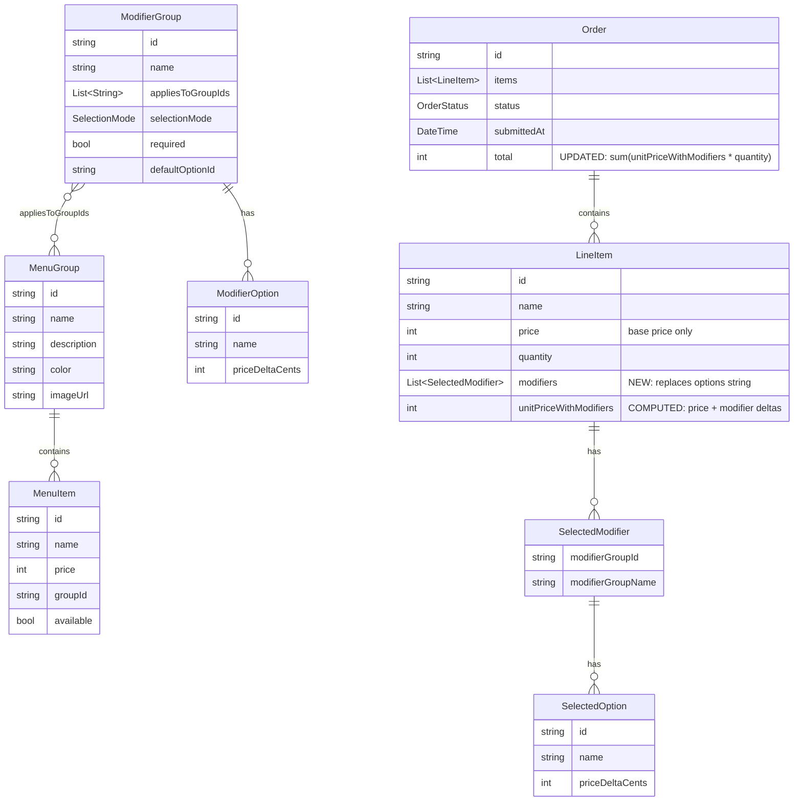

# ✨ feat: add dynamic item modifiers with pricing and category scoping

## Overview

Add server-driven modifier groups (size, milk, syrup, temperature) to menu items. Each modifier option can carry a price delta that contributes to the line item total. Modifier groups are category-scoped — they declare which `MenuGroup` IDs they apply to, so only relevant options appear for each item. All ordering surfaces (mobile, kiosk, POS) show modifier selection UI; KDS shows selected modifiers per line item; the menu board is unchanged.

This replaces the current hardcoded client-side enums (`DrinkSize`, `MilkOption`, `DrinkExtra`) and the flat `options` string on `LineItem` with structured, server-driven modifier data that carries pricing information end-to-end.

## Problem Statement

The current system has three problems:

1. **No pricing for customizations.** Modifiers like oat milk (+$0.75) or larger sizes (+$1.00) cannot add to the base price. `LineItem.price` stores only the base menu item price, and `Order.total` is `sum(price * quantity)`.

2. **Hardcoded client-side enums.** `DrinkSize`, `MilkOption`, `DrinkExtra` are defined as enums in each app's `item_detail_state.dart`. Adding or changing options requires code changes and app releases.

3. **Flat options string.** `LineItem.options` is a plain `String` (e.g. `"Medium · Whole Milk · Extra Shot"`). It cannot be parsed back into structured data for price computation or individual modifier display.

## Proposed Solution

1. Add `ModifierGroup`, `ModifierOption`, `SelectionMode` models to `very_yummy_coffee_models`
2. Add `SelectedModifier`, `SelectedOption` models to `order_repository` alongside `LineItem`
3. Replace `LineItem.options` (String) with `List<SelectedModifier> modifiers`
4. Add `unitPriceWithModifiers` getter to `LineItem`; update `Order.total` to use it
5. Add `modifierGroups` to `fixtures/menu.json` and server state
6. Update `MenuRepository` to include modifier groups in the menu stream
7. Update `OrderRepository.addItemToCurrentOrder` to accept structured modifiers
8. Add `ModifierGroupSelector` and `ModifierSummaryChips` shared widgets
9. Replace hardcoded enums with server-driven modifier UI in mobile, kiosk, and POS apps
10. Add modifier display to KDS order cards

## Technical Approach

### Model ERD



### Package Boundaries

```
very_yummy_coffee_models/        (menu domain — no dependencies)
  ├── ModifierGroup
  ├── ModifierOption
  ├── SelectionMode (enum)
  └── applicableModifierGroups()  (extension on List<ModifierGroup>)

order_repository/                (order domain — depends on api_client)
  ├── SelectedModifier
  ├── SelectedOption
  ├── LineItem                   (gains modifiers field, loses options)
  └── Order                      (total uses unitPriceWithModifiers)

very_yummy_coffee_ui/            (pure UI — no domain dependencies)
  ├── ModifierGroupSelector      (interactive, primitive params)
  └── ModifierSummaryChips       (read-only labels)
```

### Implementation Phases

---

#### Phase 0: Menu-domain models + fixture data

Add `ModifierGroup`, `ModifierOption`, and supporting types to `very_yummy_coffee_models`. Add modifier group definitions to `fixtures/menu.json`.

##### New files

- `shared/very_yummy_coffee_models/lib/src/models/modifier_option.dart`
  ```dart
  @MappableClass()
  class ModifierOption with ModifierOptionMappable {
    const ModifierOption({
      required this.id,
      required this.name,
      this.priceDeltaCents = 0,
    });
    final String id;
    final String name;
    final int priceDeltaCents;
  }
  ```

- `shared/very_yummy_coffee_models/lib/src/models/modifier_group.dart`
  ```dart
  @MappableEnum()
  enum SelectionMode { single, multi }

  @MappableClass()
  class ModifierGroup with ModifierGroupMappable {
    const ModifierGroup({
      required this.id,
      required this.name,
      required this.options,
      this.appliesToGroupIds = const [],
      this.selectionMode = SelectionMode.single,
      this.required = false,
      this.defaultOptionId,
    });
    final String id;
    final String name;
    final List<String> appliesToGroupIds;
    final SelectionMode selectionMode;
    final bool required;
    final String? defaultOptionId;
    final List<ModifierOption> options;
  }

  extension ModifierGroupFiltering on List<ModifierGroup> {
    List<ModifierGroup> applicableTo(String groupId) =>
      where((g) =>
        g.appliesToGroupIds.isEmpty ||
        g.appliesToGroupIds.contains(groupId),
      ).toList();
  }
  ```

  > `ModifierGroupType` was considered but rejected — no code switches on it. The `name` field is sufficient for display, and `selectionMode` drives all behavioral differences.

##### Modified files

- `shared/very_yummy_coffee_models/lib/src/models/models.dart` — add exports for new model files (the `ModifierGroupFiltering` extension is exported alongside `ModifierGroup`)
- `api/fixtures/menu.json` — add top-level `"modifierGroups"` array

##### Fixture modifier groups

Use existing numeric group IDs (`"1"`, `"2"`, `"3"`) in `appliesToGroupIds`:

| Group | Applies To | Selection | Required | Options |
|-------|-----------|-----------|----------|---------|
| Size | `["2"]` (Drinks only) | single | yes | Short ($0), Tall ($0, default), Grande (+$0.50), Venti (+$1.00) |
| Milk | `["2"]` | single | yes | Whole ($0, default), 2% ($0), Oat (+$0.75), Almond (+$0.75), Soy (+$0.75) |
| Syrup | `["2"]` | multi | no | Vanilla (+$0.50), Hazelnut (+$0.50), Caramel (+$0.50) |
| Temperature | `["2"]` | single | no | Hot (default), Iced |

> Note: Group `"1"` (Main/Food) and group `"3"` (Desserts) have no applicable modifier groups. Only drinks (group `"2"`) get modifiers. If #29 splits drinks into sub-categories, update `appliesToGroupIds` accordingly.

##### Tasks

- [ ] Create `modifier_option.dart` in `very_yummy_coffee_models/lib/src/models/`
- [ ] Create `modifier_group.dart` in `very_yummy_coffee_models/lib/src/models/` (includes `SelectionMode` enum and `ModifierGroupFiltering` extension)
- [ ] Update `models.dart` barrel to export new files
- [ ] Run `dart run build_runner build --delete-conflicting-outputs` in `very_yummy_coffee_models`
- [ ] Add `modifierGroups` array to `api/fixtures/menu.json` (all groups scoped to `["2"]` only)
- [ ] Write unit tests for `ModifierGroupFiltering.applicableTo()` extension — drinks group returns all, food/desserts return empty, empty `appliesToGroupIds` returns for all
- [ ] Write unit tests for `ModifierGroup` / `ModifierOption` serialization (fromMap/toMap roundtrip)
- [ ] Run `dart analyze` and `dart test` in `very_yummy_coffee_models`

##### Success criteria

- `ModifierGroupMapper.fromMap(json)` round-trips correctly
- `allGroups.applicableTo('2')` returns Size, Milk, Syrup, Temperature
- `allGroups.applicableTo('1')` returns empty list (food has no modifiers)
- `allGroups.applicableTo('3')` returns empty list (desserts have no modifiers)
- All existing tests pass (no breaking changes yet)

---

#### Phase 1: Order-domain models (LineItem breaking change)

Replace `LineItem.options` (String) with `List<SelectedModifier> modifiers`. Add `SelectedModifier` and `SelectedOption` models. Update `Order.total`.

##### New files

- `shared/order_repository/lib/src/models/selected_option.dart`
  ```dart
  @MappableClass()
  class SelectedOption with SelectedOptionMappable {
    const SelectedOption({
      required this.id,
      required this.name,
      this.priceDeltaCents = 0,
    });
    final String id;
    final String name;
    final int priceDeltaCents;
  }
  ```

- `shared/order_repository/lib/src/models/selected_modifier.dart`
  ```dart
  @MappableClass()
  class SelectedModifier with SelectedModifierMappable {
    const SelectedModifier({
      required this.modifierGroupId,
      required this.modifierGroupName,
      this.options = const [],
    });
    final String modifierGroupId;
    final String modifierGroupName;
    final List<SelectedOption> options;
  }
  ```

##### Modified files

- `shared/order_repository/lib/src/models/line_item.dart`
  - Remove `final String options;` field (and its `= ''` default)
  - Add `final List<SelectedModifier> modifiers;` (default `const []`)
  - Add computed getters (these are `get`-only — NOT constructor parameters, so dart_mappable will not serialize them):
    ```dart
    int get modifierPriceDelta => modifiers.fold(0, (sum, mod) =>
      sum + mod.options.fold(0, (s, opt) => s + opt.priceDeltaCents));

    int get unitPriceWithModifiers => price + modifierPriceDelta;
    ```
- `shared/order_repository/lib/src/models/order.dart`
  - Update `total` getter: `items.fold(0, (sum, item) => sum + item.unitPriceWithModifiers * item.quantity)`
- `shared/order_repository/lib/src/models/models.dart` — add exports for new model files

##### Tasks

- [ ] Create `selected_option.dart` in `order_repository/lib/src/models/` (include `part 'selected_option.mapper.dart';`)
- [ ] Create `selected_modifier.dart` in `order_repository/lib/src/models/` (include `part 'selected_modifier.mapper.dart';`)
- [ ] Modify `line_item.dart` — remove `options`, add `modifiers` field and computed getters
- [ ] Modify `order.dart` — update `total` getter
- [ ] Update `models.dart` barrel exports
- [ ] Run `dart run build_runner build --delete-conflicting-outputs` in `order_repository`
- [ ] Write unit tests for `SelectedModifier` / `SelectedOption` serialization
- [ ] Write unit tests for `LineItem.modifierPriceDelta` and `unitPriceWithModifiers`
- [ ] Write unit tests for `Order.total` with modifiers
- [ ] Update existing `LineItem` and `Order` tests that use `options:`

##### Success criteria

- `LineItem(price: 450, modifiers: [SelectedModifier(options: [SelectedOption(priceDeltaCents: 75)])])` → `unitPriceWithModifiers == 525`
- `Order` with two items including modifiers → `total` correctly sums `unitPriceWithModifiers * quantity`
- `LineItem(price: 450, modifiers: const [])` → `unitPriceWithModifiers == 450` (backward compat)

---

#### Phase 2: Server + repositories

Update the server to load/store/broadcast modifier data. Update `MenuRepository` to expose modifier groups. Update `OrderRepository.addItemToCurrentOrder` signature.

##### Modified files

- `api/lib/src/server_state.dart`
  - `loadMenu()`: parse `fixture['modifierGroups']` into `List<Map<String, dynamic>> _modifierGroups`
  - `snapshotForTopic('menu')`: return `{'groups': _menuGroups, 'items': _menuItems, 'modifierGroups': _modifierGroups}`
  - `handleAction('addItemToOrder')`: read `payload['modifiers'] as List<dynamic>? ?? const []` instead of `payload['options']`; store as `'modifiers'` key on the line item map (remove `'options'` key)

- `shared/menu_repository/lib/src/menu_repository.dart`
  - `_MenuCache`: add `List<ModifierGroup> modifierGroups` field
  - `_initMenuIfNeeded()`: parse `modifierGroups` from WS/HTTP payload into `ModifierGroup` objects via `ModifierGroupMapper`
  - `getMenuGroupsAndItems()` return type changes to `({List<MenuGroup> groups, List<MenuItem> items, List<ModifierGroup> modifierGroups})` — this is the single definitive approach (no separate `getModifierGroups()` stream needed)
  - Add import for `very_yummy_coffee_models` (already a dependency)

- `shared/menu_repository/pubspec.yaml` — verify `very_yummy_coffee_models` dependency exists (it should already)

- `shared/order_repository/lib/src/order_repository.dart`
  - `addItemToCurrentOrder()` signature: replace `String options` with `List<SelectedModifier> modifiers`
  - Build WS payload with `'modifiers': modifiers.map((m) => m.toMap()).toList()` instead of `'options': options`

- `api/routes/api/menu.dart` — if the HTTP GET `/api/menu` endpoint exists, ensure it also returns `modifierGroups`

##### Tasks

- [ ] Update `server_state.dart` — add `_modifierGroups` field, update `loadMenu()`, `snapshotForTopic('menu')`, and `handleAction('addItemToOrder')`
- [ ] Update `_MenuCache` to include `modifierGroups`
- [ ] Update `_initMenuIfNeeded()` to parse modifier groups from payload
- [ ] Update `getMenuGroupsAndItems()` return type to include `modifierGroups`
- [ ] Update ALL consumers of `getMenuGroupsAndItems()` to compile with the new 3-field record (even if they ignore `modifierGroups` for now):
  - `applications/mobile_app/lib/item_detail/bloc/item_detail_bloc.dart`
  - `applications/kiosk_app/lib/item_detail/bloc/item_detail_bloc.dart`
  - `applications/pos_app/lib/menu/bloc/menu_bloc.dart`
  - `applications/menu_board_app/` (grep for usage — receives modifier groups but ignores them)
  - All test files that mock `getMenuGroupsAndItems()` return value
- [ ] Update `addItemToCurrentOrder()` signature to accept `List<SelectedModifier> modifiers`
- [ ] Update HTTP menu endpoint if applicable
- [ ] Write server tests for `addItemToOrder` with modifiers payload
- [ ] Write server tests for `addItemToOrder` with empty modifiers list (food items)
- [ ] Write server tests for menu snapshot including `modifierGroups`
- [ ] Update `MenuRepository` tests for new return type
- [ ] Update `OrderRepository` tests for new `addItemToCurrentOrder` signature
- [ ] Run `dart analyze` and `dart test` across `api`, `menu_repository`, `order_repository`

##### Success criteria

- Server loads modifier groups from fixture and includes them in menu WS updates
- `addItemToOrder` with modifiers payload stores structured data on line item
- `MenuRepository.getMenuGroupsAndItems()` emits records with modifier groups
- `OrderRepository.addItemToCurrentOrder(modifiers: [...])` sends correct WS payload

---

#### Phase 3: Shared UI widgets

Add `ModifierGroupSelector` and `ModifierSummaryChips` to `very_yummy_coffee_ui`. These use primitive parameters only (no domain types).

##### New files

- `shared/very_yummy_coffee_ui/lib/src/widgets/modifier_group_selector.dart`

  Parameters:
  - `String groupName` — section label
  - `bool isRequired` — shows "(required)" indicator
  - `bool isMultiSelect` — toggles single vs multi selection behavior
  - `List<ModifierOptionData> options` — list of `({String name, int priceDeltaCents, bool isSelected})`
  - `ValueChanged<int> onOptionToggled` — callback with option index

  > `ModifierOptionData` is a plain Dart class with a `const` constructor in the same file (not a domain model, not a record type):
  > ```dart
  > class ModifierOptionData {
  >   const ModifierOptionData({
  >     required this.name,
  >     this.priceDeltaCents = 0,
  >     this.isSelected = false,
  >   });
  >   final String name;
  >   final int priceDeltaCents;
  >   final bool isSelected;
  > }
  > ```

  Renders a column with: label row (group name + required badge), wrapped row of selectable chips. Each chip shows the option name and `"+$X.XX"` only when `priceDeltaCents > 0` (options with zero delta show name only). Selected chips are highlighted. Single-select: tapping a new chip deselects the previous. Multi-select: tapping toggles.

- `shared/very_yummy_coffee_ui/lib/src/widgets/modifier_summary_chips.dart`

  Parameters:
  - `List<String> labels` — modifier summary texts (e.g. `["Oat Milk", "Grande", "Vanilla"]`)

  Renders a compact horizontal `Wrap` of small, muted chips. Used in cart line items, order summaries, and KDS cards.

##### Modified files

- `shared/very_yummy_coffee_ui/lib/src/widgets/widgets.dart` — add exports

##### Tasks

- [ ] Create `modifier_group_selector.dart` with `ModifierOptionData` helper class
- [ ] Create `modifier_summary_chips.dart`
- [ ] Export both from `widgets.dart` barrel
- [ ] Write widget tests for `ModifierGroupSelector` — single select, multi select, price display, required badge
- [ ] Write widget tests for `ModifierSummaryChips` — renders labels, handles empty list

##### Success criteria

- `ModifierGroupSelector` toggles single-select correctly (only one selected at a time)
- `ModifierGroupSelector` toggles multi-select correctly (multiple selected)
- Options with `priceDeltaCents > 0` show `"+$0.50"` label; options with `0` show name only
- `ModifierSummaryChips` renders all labels as chips

---

#### Phase 4: Mobile + Kiosk apps — modifier selection + cart display

Replace hardcoded `DrinkSize`/`MilkOption`/`DrinkExtra` enums with server-driven modifier selection in both mobile and kiosk apps. Update cart to show modifiers and adjusted prices. The mobile and kiosk `ItemDetailBloc`/state files are nearly identical — apply the same pattern to both.

##### Modified files

- `applications/mobile_app/lib/item_detail/bloc/item_detail_state.dart`
  - Remove `DrinkSize`, `MilkOption`, `DrinkExtra` enums entirely
  - Remove `selectedSize`, `selectedMilk`, `selectedExtras` from state
  - Add `List<ModifierGroup> applicableModifierGroups` to state
  - Add `Map<String, List<String>> selectedModifiers` — `groupId → [selectedOptionIds]`
    > **Immutability note:** Bloc handlers must NEVER mutate the map or inner lists in place. Always create new instances: `final newMap = Map<String, List<String>>.from(state.selectedModifiers); newMap[groupId] = [...(newMap[groupId] ?? []), optionId];` then `emit(state.copyWith(selectedModifiers: newMap))`.
  - Update `totalPrice` getter: compute `(basePrice + selectedModifierDeltas) * quantity` (look up `priceDeltaCents` from `applicableModifierGroups` for each selected option ID)
  - Add `bool get canAddToCart` — all required groups have at least one selection

- `applications/mobile_app/lib/item_detail/bloc/item_detail_event.dart`
  - Remove `ItemDetailSizeChanged`, `ItemDetailMilkChanged`, `ItemDetailExtraToggled` events
  - Add `ItemDetailModifierOptionToggled({required String groupId, required String optionId})` — generic event for all modifier interactions

- `applications/mobile_app/lib/item_detail/bloc/item_detail_bloc.dart`
  - Remove handlers for `SizeChanged`, `MilkChanged`, `ExtraToggled`
  - In `_onSubscriptionRequested`: subscribe to `menuRepository.getMenuGroupsAndItems()` to get modifier groups, filter with `allGroups.applicableTo(item.groupId)`, initialize `selectedModifiers` from `defaultOptionId` for each required group
  - Add `_onModifierOptionToggled` handler: for single-select groups, replace selection; for multi-select, toggle
  - Update `_onAddToCartRequested`: build `List<SelectedModifier>` from `selectedModifiers` map + modifier group definitions, call `orderRepository.addItemToCurrentOrder(modifiers: ...)` instead of `options:`

- `applications/mobile_app/lib/item_detail/view/item_detail_view.dart`
  - Remove `_CustomizationCard` widgets for size/milk/extras
  - Replace with `BlocBuilder` that renders `ModifierGroupSelector` for each applicable group
  - Map domain state to widget: `ModifierOptionData(name: opt.name, priceDeltaCents: opt.priceDeltaCents, isSelected: selectedModifiers[groupId]?.contains(opt.id) ?? false)`
  - Update price display to use computed `totalPrice` (which now includes modifiers)
  - Disable "Add to Cart" button when `!state.canAddToCart`

- `applications/mobile_app/lib/cart/view/cart_view.dart`
  - Replace `item.options` display with `ModifierSummaryChips(labels: ...)` derived from `item.modifiers`
  - Replace `item.price` display with `item.unitPriceWithModifiers` for line item price
  - Display `'${item.unitPriceWithModifiers * item.quantity}'` for line total (or keep per-unit and multiply — match existing pattern)

- `applications/mobile_app/lib/order_complete/view/order_complete_view.dart`
  - Update any `item.price` usage to `item.unitPriceWithModifiers`
  - Add modifier summary display if order complete shows line item details

- `applications/mobile_app/lib/checkout/view/checkout_view.dart`
  - Same updates as cart — use `unitPriceWithModifiers` and show modifier summary

##### Removed l10n keys (dead code)

- `itemDetailSizeLabel`, `itemDetailMilkLabel`, `itemDetailExtrasLabel` — replace with server-driven group names

##### Tasks

- [ ] Rewrite `item_detail_state.dart` — remove enums, add modifier tracking
- [ ] Rewrite `item_detail_event.dart` — generic modifier toggle event
- [ ] Rewrite `item_detail_bloc.dart` — subscribe to modifier groups, handle generic toggle, build SelectedModifier list
- [ ] Update `item_detail_view.dart` — replace hardcoded sections with `ModifierGroupSelector` widgets
- [ ] Update `cart_view.dart` — `ModifierSummaryChips` + `unitPriceWithModifiers`
- [ ] Update `order_complete_view.dart` — `unitPriceWithModifiers` + modifier summary
- [ ] Update `checkout_view.dart` — `unitPriceWithModifiers` + modifier summary
- [ ] Clean up dead l10n keys in `applications/mobile_app/lib/l10n/arb/` ARB files (`itemDetailSizeLabel`, `itemDetailMilkLabel`, `itemDetailExtrasLabel`)
- [ ] Rewrite `item_detail_bloc_test.dart` — test modifier initialization from defaults, toggle single/multi, canAddToCart validation, add-to-cart with structured modifiers
- [ ] Update `cart_bloc_test.dart` — use `LineItem(modifiers: [...])` instead of `options:`
- [ ] Update `cart_view` widget tests
- [ ] Update `order_complete` and `checkout` tests
- [ ] Run `dart analyze` and `dart test` for mobile_app

**Kiosk app** — apply the same changes under `applications/kiosk_app/`. The kiosk `ItemDetailBloc` and views are nearly identical to mobile's. Key difference: kiosk navigates to `/home/menu/$groupId` after add (not to cart).

- [ ] Rewrite kiosk `item_detail_state.dart`, `item_detail_event.dart`, `item_detail_bloc.dart` (same pattern as mobile)
- [ ] Update kiosk `item_detail_view.dart` — `ModifierGroupSelector` widgets (kiosk-specific full-screen layout)
- [ ] Update kiosk `cart_view.dart` — `ModifierSummaryChips` + `unitPriceWithModifiers`
- [ ] Update kiosk `order_complete_view.dart` if it displays line items
- [ ] Clean up dead l10n keys in `applications/kiosk_app/lib/l10n/arb/`
- [ ] Rewrite kiosk `item_detail_bloc_test.dart`
- [ ] Update kiosk cart and order complete tests
- [ ] Run `dart analyze` and `dart test` for kiosk_app

##### Success criteria

- Item detail page renders modifier groups from server data (both mobile and kiosk)
- Required groups with `defaultOptionId` are pre-selected on load
- Add-to-cart button disabled when required groups have no selection
- Cart shows modifier summary chips and adjusted price per line item
- Order total includes modifier price deltas
- Kiosk uses full-screen landscape layout for modifier sections

---

#### Phase 5: POS app — modifier bottom sheet

Add a modifier selection bottom sheet for items with applicable modifiers. Items without modifiers continue to quick-add as today.

##### New files

- `applications/pos_app/lib/menu/view/widgets/modifier_bottom_sheet.dart`

  A bottom sheet that takes pre-loaded modifier groups and the menu item, renders `ModifierGroupSelector` for each applicable group. Includes a "Confirm" button that is disabled until required groups are satisfied. Returns a `List<SelectedModifier>` via `Navigator.pop(context, result)`.

##### Modified files

- `applications/pos_app/lib/menu/bloc/menu_bloc.dart`
  - `MenuState` gains `List<ModifierGroup> modifierGroups` (loaded alongside groups and items from `getMenuGroupsAndItems()`)
  - `_onItemAdded`: for items with no applicable modifiers, call `addItemToCurrentOrder(modifiers: const [])` directly. For items with modifiers, the Bloc does NOT show the bottom sheet — the view handles this (see below).

- `applications/pos_app/lib/menu/bloc/menu_event.dart`
  - Add `MenuItemAddedWithModifiers({required MenuItem item, required List<SelectedModifier> modifiers})` event (dispatched after bottom sheet returns)

- `applications/pos_app/lib/menu/bloc/menu_state.dart`
  - Add `List<ModifierGroup> modifierGroups` field
  - **No `pendingModifierItem` field** — the view decides whether to show the bottom sheet at tap time

- `applications/pos_app/lib/menu/view/menu_view.dart`
  - The item tap handler checks `state.modifierGroups.applicableTo(item.groupId)` inline:
    - If empty: dispatch `MenuItemAdded(item: item)` immediately (quick-add)
    - If non-empty: show `ModifierBottomSheet` via `showModalBottomSheet`, await result, then dispatch `MenuItemAddedWithModifiers(item: item, modifiers: result)`
  - This keeps UI-triggering logic in the view (not in Bloc state) and avoids the "consumed once" anti-pattern

- `applications/pos_app/lib/ordering/view/widgets/order_ticket_line_item.dart`
  - Change `lineItem.price * lineItem.quantity` to `lineItem.unitPriceWithModifiers * lineItem.quantity`
  - Add `ModifierSummaryChips` below item name if `lineItem.modifiers.isNotEmpty`

- `applications/pos_app/lib/order_complete/view/order_complete_view.dart`
  - Update price display to use `unitPriceWithModifiers`

##### Tasks

- [ ] Create `modifier_bottom_sheet.dart` with modifier selection UI using `ModifierGroupSelector` widgets
- [ ] Update `MenuBloc` — load modifier groups into state, handle `MenuItemAddedWithModifiers` event
- [ ] Update `MenuState` — add `modifierGroups` field (no `pendingModifierItem`)
- [ ] Add `MenuItemAddedWithModifiers` event
- [ ] Update `MenuView` — inline modifier check at tap time, show bottom sheet or quick-add
- [ ] Update `OrderTicketLineItem` — adjusted price (`unitPriceWithModifiers`) + `ModifierSummaryChips`
- [ ] Update POS `order_complete_view.dart` — `unitPriceWithModifiers`
- [ ] Write tests for `MenuBloc` modifier flow — items with/without modifiers
- [ ] Write widget tests for `modifier_bottom_sheet.dart`
- [ ] Update `OrderTicketLineItem` tests
- [ ] Update POS order complete tests
- [ ] Run `dart analyze` and `dart test` for pos_app

##### Success criteria

- Tapping a food item (group `"1"`) or dessert (group `"3"`) quick-adds with empty modifiers (no bottom sheet)
- Tapping a drink item (group `"2"`) opens modifier bottom sheet
- Bottom sheet shows applicable modifier groups with correct options
- Confirm button disabled until required groups satisfied
- Order ticket shows modifier summary + adjusted price

---

#### Phase 6: KDS app — modifier display

Show selected modifier names under each line item on KDS order cards.

##### Modified files

- `applications/kds_app/lib/kds/view/widgets/kds_order_card.dart`
  - Below `'${item.quantity}× ${item.name}'`, add `ModifierSummaryChips` from the shared UI package:
    ```dart
    if (item.modifiers.isNotEmpty)
      ModifierSummaryChips(
        labels: item.modifiers
          .expand((m) => m.options)
          .map((o) => o.name)
          .toList(),
      ),
    ```
  - No price display needed on KDS

##### Tasks

- [ ] Update `kds_order_card.dart` — add `ModifierSummaryChips` below item name
- [ ] Write widget test for KDS order card with modifiers
- [ ] Write widget test for KDS order card with empty modifiers (no extra widget)
- [ ] Run `dart analyze` and `dart test` for kds_app

##### Success criteria

- KDS card shows "Oat · Grande · Vanilla" below "1× Latte"
- KDS card shows only "1× Croissant" for items with no modifiers

---

#### Final validation (after all phases)

Each phase includes `dart analyze` and `dart test` steps. This final pass catches anything that slipped through.

- [ ] Grep for any remaining `LineItem(.*options:` across ALL files — should be zero
- [ ] Grep for any remaining `item.options` in view files — should be zero
- [ ] Grep for `item.price *` in view files — verify all line total computations use `item.unitPriceWithModifiers *`
- [ ] Run `dart format` across all packages
- [ ] Run `.github/update_github_actions.sh` (required if any `pubspec.yaml` changed)
- [ ] Run full test suite: `very_good test --recursive`
- [ ] Verify menu board app is unchanged and its tests pass

---

## Alternative Approaches Considered

See [brainstorm doc](../ideate/2026-03-06-item-modifiers-brainstorm-doc.md) for full analysis. Key rejections:

- **Dual scoping** (category + per-item) — YAGNI; no item needs different modifiers than its category siblings
- **Pre-computed unit price** on LineItem — loses base vs. modifier breakdown
- **ID-only SelectedModifier** (not denormalized) — couples order display to menu state
- **Server-side validation** — adds complexity (WS error type, `itemId` in payload) for limited benefit; client validates

## Acceptance Criteria

### Functional Requirements

- [ ] `ModifierGroup`, `ModifierOption`, `SelectionMode` models exist in `very_yummy_coffee_models` with dart_mappable serialization
- [ ] `SelectedModifier`, `SelectedOption` models exist in `order_repository` with dart_mappable serialization
- [ ] `LineItem.options` (String) removed; `LineItem.modifiers` (List<SelectedModifier>) added
- [ ] `LineItem.unitPriceWithModifiers` getter computes `price + sum(modifier deltas)`
- [ ] `Order.total` uses `unitPriceWithModifiers * quantity`
- [ ] `fixtures/menu.json` defines at least 4 modifier groups with category scoping
- [ ] Menu WS payload includes `modifierGroups` array
- [ ] `addItemToOrder` WS action stores structured modifier data on line items
- [ ] `MenuRepository.getMenuGroupsAndItems()` returns modifier groups
- [ ] `applicableModifierGroups()` utility correctly filters by group ID
- [ ] `ModifierGroupSelector` shared widget supports single/multi select with price display
- [ ] `ModifierSummaryChips` shared widget renders compact label row
- [ ] Mobile `ItemDetailPage` shows server-driven modifiers, validates required, blocks add if invalid
- [ ] Kiosk `ItemDetailPage` shows server-driven modifiers (same behavior as mobile)
- [ ] POS opens modifier bottom sheet for items with modifiers; quick-adds items without
- [ ] KDS order cards show modifier names under each line item
- [ ] Menu board app is unchanged
- [ ] Items with no applicable modifiers (food) work with empty modifiers list
- [ ] Default options are pre-selected on page load for required groups

### Non-Functional Requirements

- [ ] All new code passes `dart analyze` with zero warnings
- [ ] All new code passes `dart format` check
- [ ] No raw `Color(0xFF...)` literals — use `context.colors.xxx`
- [ ] No `EdgeInsets.fromLTRB` — use `.symmetric` or `.only`
- [ ] Spacing/radius use design tokens (`context.spacing.xxx`, `context.radius.xxx`)

### Quality Gates

- [ ] All existing tests updated and passing
- [ ] New unit tests for all models, getters, and utility functions
- [ ] New widget tests for `ModifierGroupSelector` and `ModifierSummaryChips`
- [ ] New bloc tests for modifier selection flows in mobile, kiosk, and POS
- [ ] GitHub Actions workflows regenerated if any `pubspec.yaml` changed

## Dependencies & Prerequisites

- **No external dependencies required.** All changes are internal to the monorepo.
- **Issue #29 (expanded menu)** is independent. The modifier groups defined here use the current fixture's 3 menu groups. If #29 lands first or concurrently and adds new groups, the `appliesToGroupIds` in modifier definitions may need updating.
- **Phase ordering is strictly sequential** for Phases 0→1→2→3. Phases 4-6 can be partially parallelized after Phase 3 completes.

## Risk Analysis & Mitigation

| Risk | Impact | Mitigation |
|------|--------|------------|
| `LineItem.options` removal breaks ~23 files | High — compile errors across all apps | Phases 0-2 are one atomic change; fix all call sites before committing |
| `getMenuGroupsAndItems()` return type change breaks all consumers | Medium — compile errors in blocs and tests | Single coordinated update in Phase 2 |
| Fixture group IDs (`"1"`, `"2"`, `"3"`) are fragile | Low — easy to typo `appliesToGroupIds` | Validate in server `loadMenu()` or via tests |
| POS modifier bottom sheet is new UX pattern | Medium — no existing bottom sheet pattern in POS | Follow Flutter standard `showModalBottomSheet`; keep simple |
| In-memory server state has no migration | None — server restart clears state | Document as expected behavior |

## Future Considerations

- **Cart item modifier editing** — scoped out. Follow-up feature to allow tapping a cart item to change modifiers (requires new WS action like `updateLineItemModifiers`).
- **`maxSelections` for multi-select groups** — scoped out. Follow-up if needed to limit e.g. number of syrups.
- **Server-side validation** — scoped out. Could be added later with a WS error message type and `itemId` in payload.
- **Per-item modifier overrides** — if a single item ever needs different modifiers than its category, add `modifierGroupIds` to `MenuItem` as an override.

## Documentation Plan

- [ ] Update `CLAUDE.md` WS protocol section with new payload formats
- [ ] Update `CLAUDE.md` architecture notes with modifier data flow
- [ ] Update memory file with new model locations and patterns

## References & Research

### Internal References

- Brainstorm: [docs/ideate/2026-03-06-item-modifiers-brainstorm-doc.md](../ideate/2026-03-06-item-modifiers-brainstorm-doc.md)
- Current `LineItem` model: `shared/order_repository/lib/src/models/line_item.dart`
- Current `Order` model: `shared/order_repository/lib/src/models/order.dart`
- Server state: `api/lib/src/server_state.dart` (lines 109-125 for `addItemToOrder`, line 74 for `snapshotForTopic`)
- Menu repository: `shared/menu_repository/lib/src/menu_repository.dart` (lines 8-16 for `_MenuCache`, lines 75-82 for `getMenuGroupsAndItems()`)
- Order repository: `shared/order_repository/lib/src/order_repository.dart` (lines 71-89 for `addItemToCurrentOrder`)
- Mobile item detail bloc: `applications/mobile_app/lib/item_detail/bloc/item_detail_bloc.dart` (lines 87-113 for `_onAddToCartRequested`)
- POS menu bloc: `applications/pos_app/lib/menu/bloc/menu_bloc.dart` (lines 49-64 for `_onItemAdded`)
- KDS order card: `applications/kds_app/lib/kds/view/widgets/kds_order_card.dart` (lines 74-82)
- Shared UI widgets: `shared/very_yummy_coffee_ui/lib/src/widgets/widgets.dart`

### Related Work

- Issue #30: https://github.com/VGVentures/very-yummy-coffee/issues/30
- Issue #29: expanded menu (may affect modifier group `appliesToGroupIds`)
- Issue #28: item images (independent)
