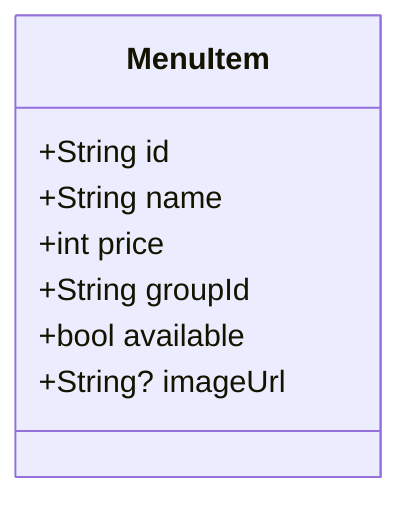

## feat: menu item images and image support across apps

**Brainstorm:** [2026-03-30 menu item images](../ideate/2026-03-30-menu-item-images-brainstorm-doc.md) — Approach A (`Image.network`), hero vs thumbnail variants, menu board item image as rounded rect (distinct from circular group art), **POS grid thumbnail deferred** in v1.

**Tracking:** [GitHub issue #28](https://github.com/VGVentures/very_yummy_coffee/issues/28)

## Problem / feature description

`MenuItem` has no image field. Item detail heroes on mobile and kiosk use static gradients and icons; the menu board shows group imagery but not per-item photos. Adding an optional `imageUrl`, fixture data, API passthrough, and a shared `MenuItemImage` widget satisfies the issue and keeps styling on design tokens.

## Stakeholders

| Audience | Impact |
|----------|--------|
| End users (mobile, kiosk, menu board) | Richer menu visuals; loading/error handled gracefully |
| Developers | One shared widget; model + mapper regeneration; tests updated where `MenuItem` JSON or constructors appear |

## Background and motivation

- `MenuGroup` already exposes optional `imageUrl`; `FeaturedItemPanel` uses `NetworkImage` for **group** circles.
- Server stores menu rows as `List<Map<String, dynamic>>` validated at load via `MenuItemMapper.fromMap` (`api/lib/src/server_state.dart`). Snapshots and WS broadcasts send those maps as-is—**adding `imageUrl` to the model and fixture propagates automatically** if availability updates preserve unknown keys (they use map spreads; verify below).
- `menu_repository` rebuilds `MenuItem` from WS/HTTP payloads with `MenuItemMapper.fromMap` — no repository API shape change beyond deserialization.

## Technical considerations

### Model

- Add `String? imageUrl` with default `null` to `shared/very_yummy_coffee_models/lib/src/models/menu_item.dart`.
- Run codegen (`dart run build_runner build` in the models package) so `menu_item.mapper.dart` includes the field.
- **Backwards compatibility:** Missing JSON key deserializes to `null`. Existing `const MenuItem(...)` call sites keep compiling when `imageUrl` is omitted (default `null`).

### Backend / fixtures

- Add `"imageUrl": "https://..."` to **each** object in `api/fixtures/menu.json` `items` array. Use stable HTTPS placeholder or CDN URLs (e.g. per-item distinct images so QA can tell items apart).
- Confirm `updateMenuItemAvailability` path uses `{...item, 'available': available}` so **`imageUrl` is retained** when toggling stock (`api/lib/src/server_state.dart`).

### Shared UI (`very_yummy_coffee_ui`)

- New widget **`MenuItemImage`** (name final in implementation):
  - **Inputs:** `String? imageUrl`, layout mode (hero vs thumbnail per brainstorm), `BoxFit` where relevant; **no** repository or `MenuItem` type imports.
  - **Null URL:** render placeholder only (no network).
  - **Non-null URL:** `Image.network` with `loadingBuilder` / `frameBuilder` and `errorBuilder` — failed loads use the **same** placeholder as null.
  - **Tokens:** `context.colors.imagePlaceholder` (and existing theme tokens); icon for empty/error consistent with current café icon pattern where appropriate.
  - **Two layouts:** **Hero** — fills bounded area with `BoxFit.cover`, clipped rounded rect matching parent design; **Thumbnail** — square, small fixed extent for optional future list/grid use (implement widget API now; POS v1 does not require wiring).
- Export from `lib/src/widgets/widgets.dart`.
- **Dependency:** Approach A only — **no** new `pubspec` entries; no `.github/update_github_actions.sh` unless later switching to Approach B.

### Per-app integration

| App | Work |
|-----|------|
| **mobile_app** | Replace/supplement `_HeroSection` in `item_detail_view.dart` to show `MenuItemImage` hero when `item.imageUrl != null` (or always wrap region: image when URL, else current gradient+icon). Issue requires image on **ItemDetailPage** — hero must display the item image path when URL present. |
| **kiosk_app** | `_ItemHeroPanel` in `item_detail_view.dart`: same pattern as mobile. |
| **menu_board_app** | `FeaturedItemPanel` (and any other item row widgets): add prominent **item** image using `MenuItemImage` hero or card variant — **rounded rectangle**, not the same circle as the group image. |
| **pos_app** | **No change in v1** for optional grid thumbnail (brainstorm default). |
| **kds_app** | No images (per issue). |

### Testing

- **`very_yummy_coffee_ui`:** Widget tests for `MenuItemImage`: null URL; non-null with **mocked HTTP** (see `ai-coding` standards / `HttpOverrides` or project test utilities) — **no live network in CI**.
- Update any tests that assert on exact `MenuItem` field lists or JSON maps if they break after mapper change (`menu_repository_test`, app bloc/view tests using inline JSON).
- Run affected test suites per package after changes.

### User flows and edge cases (flow review)

| Flow | Expected behavior |
|------|---------------------|
| Open item detail, valid `imageUrl` | Image loads; placeholder while loading |
| Open item detail, `imageUrl` null | Placeholder only (current look or unified placeholder) |
| Open item detail, broken URL | Same placeholder as null |
| Menu board rotation / featured item | Item image visible in rounded rect area; group circle unchanged |
| Barista toggles availability | Item image unchanged; maps preserve `imageUrl` |
| KDS | Unchanged |

**Gap addressed:** Explicit test strategy avoids flaky CI from real network fetches.

## Dependencies and risks

| Risk | Mitigation |
|------|------------|
| Flaky tests hitting real URLs | Mock network layer in widget tests |
| Large diff in generated mapper | Single codegen pass; commit generated file |
| Visual regression | Manual smoke on mobile, kiosk, menu board; optional goldens if project already uses them for these widgets |

## Success criteria

Align with [issue #28](https://github.com/VGVentures/very_yummy_coffee/issues/28) acceptance criteria:

- [ ] `MenuItem` has optional `imageUrl` (nullable, backwards-compatible)
- [ ] `fixtures/menu.json` has an image URL for every item
- [ ] HTTP + WS menu payloads include `imageUrl` (via maps / `MenuItem` serialization)
- [ ] `MenuItemImage` exists with loading / error / placeholder behavior
- [ ] Mobile `ItemDetailPage` shows the image in the hero area
- [ ] Kiosk `ItemDetailPage` shows the image in the hero panel
- [ ] Menu board shows item images prominently (rounded rect, distinct from group)
- [ ] Widget tests for `MenuItemImage`
- [ ] No raw `Color(0x...)` or `TextStyle(fontFamily: ...)` in new view code (tokens only)

## Implementation plan (phased)

### Phase 1 — Model and data

- [ ] Add `imageUrl` to `MenuItem` + run build_runner in `very_yummy_coffee_models`
- [ ] Add per-item `imageUrl` entries to `api/fixtures/menu.json`
- [ ] Verify server load and `updateMenuItemAvailability` preserve `imageUrl`
- [ ] Add or adjust unit test for `MenuItem` JSON round-trip with and without `imageUrl` if not already covered

### Phase 2 — `MenuItemImage` + tests

- [ ] Implement `MenuItemImage` in `shared/very_yummy_coffee_ui/lib/src/widgets/`
- [ ] Export widget; use design tokens only
- [ ] Add widget tests (mocked network / null / error)

### Phase 3 — Apps

- [ ] **mobile_app:** `item_detail_view.dart` — integrate hero `MenuItemImage`
- [ ] **kiosk_app:** `item_detail_view.dart` — integrate hero `MenuItemImage`
- [ ] **menu_board_app:** `featured_item_panel.dart` (and related display widgets if needed) — item image as rounded rect/card
- [ ] Run `flutter test` / `very_good test` for touched packages

### Phase 4 — Polish and verification

- [ ] Manual pass: load item detail on mobile + kiosk; open menu board
- [ ] If any `pubspec.yaml` changed unexpectedly, run `.github/update_github_actions.sh` (not expected for Approach A)

## Out of scope (v1)

- POS ordering grid thumbnails
- KDS imagery
- `cached_network_image` (Approach B) unless product requests it later
- Serving images from the Dart Frog server (URLs remain external)

## Alternative approaches (reference)

See brainstorm: Approach B (caching package) if scroll performance becomes an issue; Approach C (assets only) deferred.

---

## Next steps (pick one)

1. **Open the plan file** in the editor for review (`docs/plan/2026-03-30-feat-menu-item-images-plan.md`).
2. **Run a technical review** on this plan (e.g. `/plan-technical-review` or internal review checklist).
3. **Refine the plan** — adjust phases or scope before coding.
4. **Start implementation** — create a feature branch from main (current branch: `ci/shorebird-linux-gtk-deps`; use a dedicated `feat/menu-item-images` or similar for implementation work).
